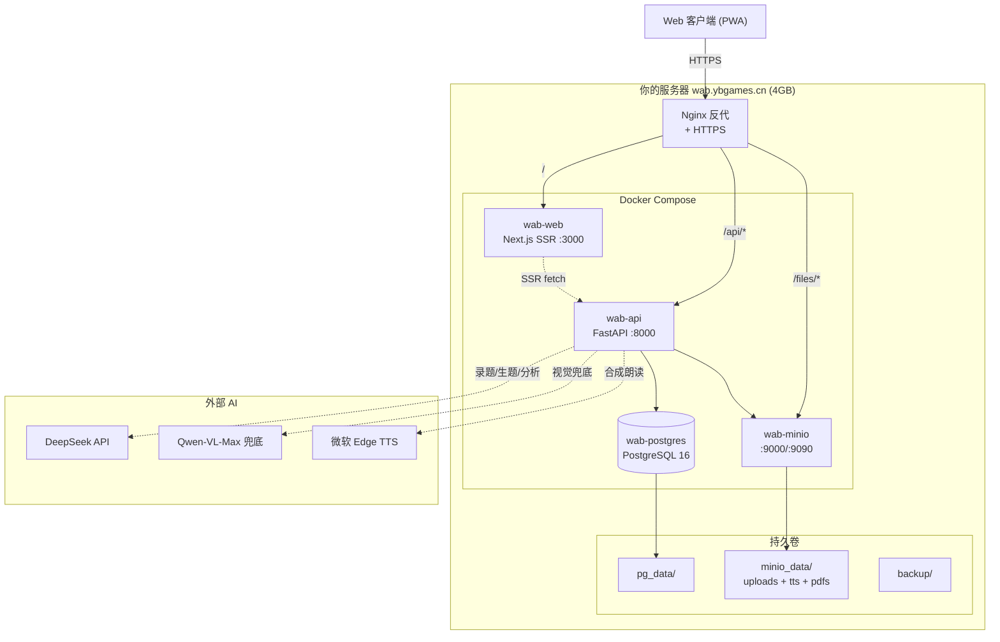

# 系统架构

## 高层架构图



## 数据流

### 录题
```
拍照 → 前端 → API → DeepSeek-VL2 抽取结构化 JSON
                  → 原图存 MinIO（uploads bucket）
                  → 元数据写 PG
                  → 家长 1-2 秒确认 → DONE
```

### 复习
```
打开复习页 → API 按 FSRS 算法选今日错题
          → 兴趣化模式开关：ON → 调 DeepSeek-V3 实时改写
          → 朗读按钮：→ 调 edge-tts（缓存命中即秒返）
          → 答题完成 → 喂 FSRS 状态回写 PG
```

### AI 生题
```
错题详情页 → 选维度 → DeepSeek-V3 生成 5-10 道
         → 家长审核采纳 → variants 表
         → PDF 导出（WeasyPrint）
```

## 数据模型 ER 图

> 当前 Sprint 0 已落地：USER + INTEREST_TAG。
> 完整 ER 图见 [脑暴会议纪要 §3.2](../_bmad-output/planning-artifacts/brainstorming-session-wab-20260531.md)。
> 后续 Sprint 会逐步建表。

## 关键设计原则

详见 [脑暴会议纪要 §4](../_bmad-output/planning-artifacts/brainstorming-session-wab-20260531.md)：13 个产品决策（D-01 ~ D-13）。

核心三条：
- **D-02 录入 30 秒原则**：拍照到入库 ≤ 30 秒/题，绝不让家长打字
- **D-07 家庭对战为 P0**：爸妈是产品的一等公民
- **D-12 本地优先**：12 年数据不绑死服务器，一键全量导出
